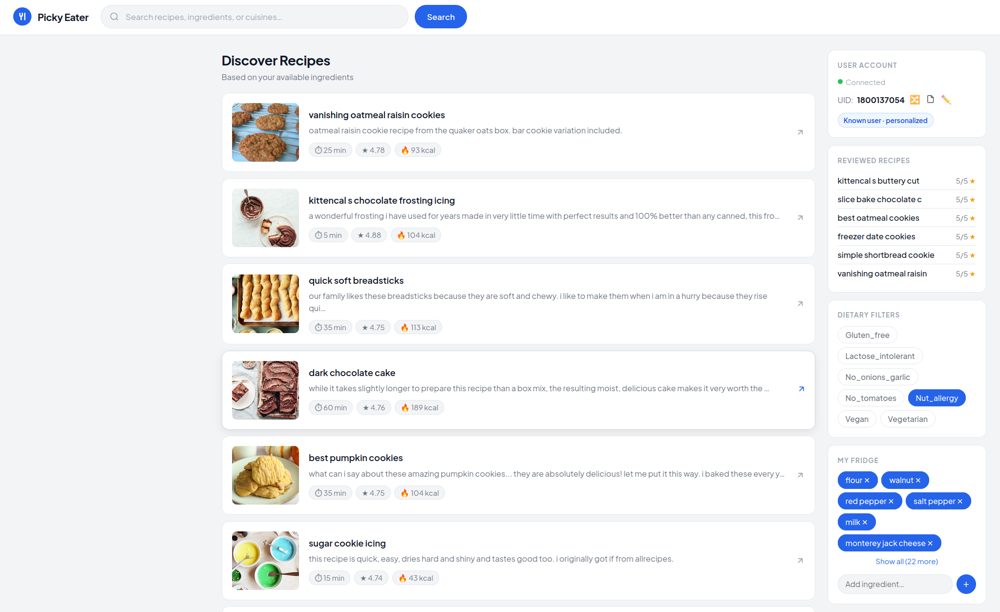
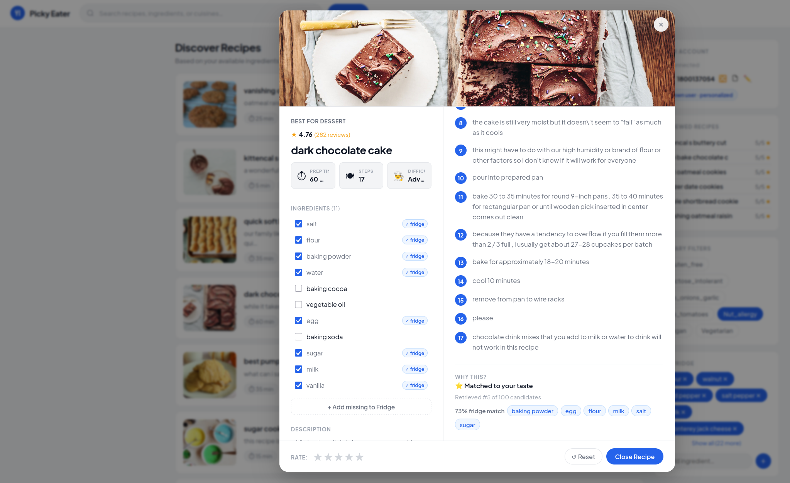

# Picky Eater

A personalized recipe recommendation web app. It learns your taste from ratings, knows what's in your fridge, and respects your dietary restrictions.



---

## What it does

- **Personalized recommendations** — the more recipes you rate, the better it gets
- **Fridge-aware** — tell it what ingredients you have and it prioritizes recipes you can actually make
- **Dietary filters** — filter by vegan, gluten-free, and other diet labels
- **Search** — keyword search and semantic (meaning-based) search powered by sentence embeddings
- **Cold-start support** — works even for brand new users by falling back to popular recipes



---

## How it works

Recommendations go through three stages:

1. **Retrieval** — a Two-Tower neural network scores all recipes against the user's taste profile and returns the top 100 candidates. New users fall back to a popularity ranking based on Bayesian average rating.

2. **Ranking** — a LightGBM model re-scores the candidates using features like nutritional fit, fridge overlap, and retrieval score.

3. **Diversification** — Maximal Marginal Relevance (MMR) picks the final results, balancing relevance with variety so you don't get ten pasta dishes in a row.

---

For a full walkthrough of the data pipeline, model training, and evaluation see [`notebooks/notebook-picky-eater.ipynb`](notebooks/notebook-picky-eater.ipynb).

---

## How to run

**1. Install dependencies**

```bash
uv sync
```

**2. Add your artifacts**

The app expects trained model files in an `artifacts/` folder at the project root. This folder is not included in the repo (it's too large). Train the models using the notebooks in `notebooks/` or get the artifacts separately.

**3. Start the server**

```bash
uv run uvicorn app.main:app --reload
```

Then open [http://localhost:8000](http://localhost:8000) in your browser.

---

*Made for food lovers, picky eaters, and everyone in between :)*
